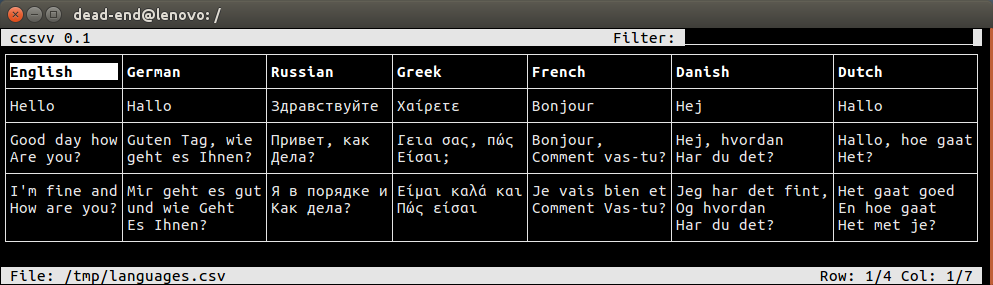

# ccsvv
ccsvv (curses csv viewer) is a programm that displays [CSV](https://en.wikipedia.org/wiki/Comma-separated_values) (comma-separated values) files as a table.

## Usage

```
ccsvv [-h] [-m] [-n] [-d delimiter] [file]

  -h            Shows this usage message.

  -d delimiter  Defines a delimiter character, other than the default comma.

  -m            By default ccsvv uses colors if the terminal supports them. With
                this option ccsvv is forced to use a monochrom mode.

  -n            By default ccsvv interpretes the first row of  the  table  as  a
                header.  The header row is highlighted and on filtering, it is
                alway part of the result, even if no field contains the filter
                string. With this option  special  role  of the first line is
                switched off.

  file          The name of the csv file. If no filename is defined, ccsvv reads
                the csv data from stdin.
```
## Examples
ccsvv can deal with multi-line fields and supports unicode characters (wchar_t).
```
ccsvv languages.csv
```


If the terminal does not support colors, ccsvv shows the table in a monochrome mode, which can be enforced by the `-m` command line option.
```
ccsvv -m languages.csv
```


ccsvv can be used to browse through all kinds of csv like files. The following example shows the `/etc/passwd` file, filtered by `sys`.
```
ccsvv -nd : /etc/passwd
```

## Example: Database
Most databases are able to store tables dumps or queries in csv files, which can be displayed with ccsvv. The following example shows a sql statement from MariaDB, that stores a query against the `user` table in a csv file. It takes a little affort to add the table header to the csv file:

```sql
SELECT 'Host', 'User', 'Max Questions', 'Max Updates', 'Max Connections', 'Max User Uonnections'
UNION ALL
SELECT Host, User, max_questions, max_updates, max_connections, max_user_connections
  INTO OUTFILE '/tmp/query.csv'
  FIELDS TERMINATED BY ',' OPTIONALLY ENCLOSED BY '"'
  LINES TERMINATED BY '\n'
  from user;
```

After creating the sql file you can call the following command to display the result with ccsvv.

```bash
sudo rm -f /tmp/query.csv && sudo mysql -u root -h localhost mysql < /tmp/query.sql && ccsvv /tmp/query.csv
```


## Implementation details
Each table consists of columns and rows. Each row has a maximum heigth and 
each column has a maximum width.
If the table width and hight is larger than the window size, only a part of
the table will be visualized.

The table view has a reference field. The reference field is aligned with one
of the corners. The fields at the oposite sides of the window may be truncated.


A truncated field may be truncated left or right or at top or bottom.


