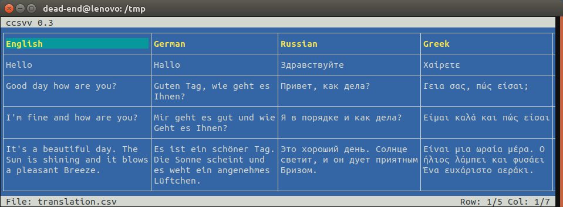
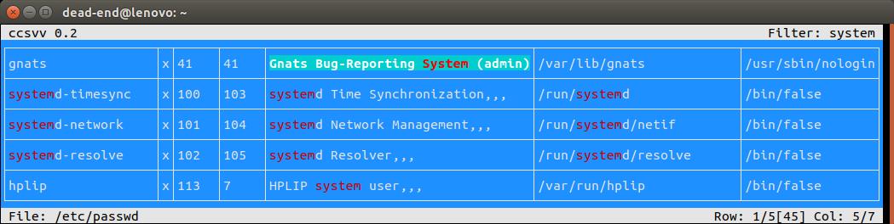
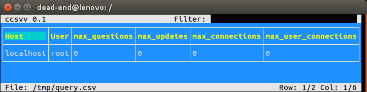

# ccsvv
**ccsvv** (curses csv viewer) is a program that displays [CSV](https://en.wikipedia.org/wiki/Comma-separated_values) (comma-separated values) files as a table. It supports:

* different field separators
* escaping with **"**
* multi line fields
* different line endings (win / mac / linux)
* unicode characters (wchar_t)
* header detection (see below)



## Usage
```
ccsvv [-h] [-m] [-s | -n] [-d delimiter] [file]

  -h            Shows this usage message.

  -d delimiter  Defines a delimiter character, other than the default comma.

  -m            By default ccsvv uses colors if the terminal supports them. With
                this option ccsvv is forced to use a monochrom mode.

  -s | -n       The flags define whether the first row of the table is
                interpreted as a header for the table ('-s') or not ('-n').
                If none of the flags is given ccsvv tries to detect whether a
                header is present or not.

  file          The name of the csv file. If no filename is defined, ccsvv reads
                the csv data from stdin.

Commands:

  ^C and ^Q     Terminate the program.

  ^F            Switches to filter input mode and allows to input a filter
                string.

  ^X            In filter mode, deletes the filter string.

  ESC           Delete the filter string and reset the table.

  ^N and ^P     Search for the next / previous field that contains the filter
                string.
```
## Installation
**ccsvv** uses *ncursesw* to create and display the tables. *ncursesw* is the wide character version of *ncurses*. To sucessfully compile **ccsvv** requires a package with the library and a develpoer package with the header files. For ubuntu this is:

* libncursesw5
* libncursesw5-dev

**ccsvv** can be simply build with:

```
make
```
An alternative is to use cmake. This can be done with:
```
mkdir cmake-build
cd cmake-build
cmake -DCMAKE_BUILD_TYPE=Release ..
make
make test
```

## Example: /etc/passwd
**ccsvv** can be used to browse through all kinds of csv like files. The following example shows the `/etc/passwd` file, filtered by `system`.
```
ccsvv -nd : /etc/passwd
```

## Example: Database
Most databases are able to store tables dumps or queries in csv files, which can be displayed with **ccsvv**. The following example shows a sql statement from MariaDB, that stores a query against the `user` table in a csv file. It takes a little affort to add the table header to the csv file:

```sql
SELECT 'Host', 'User', 'Max Questions', 'Max Updates', 'Max Connections', 'Max User Uonnections'
UNION ALL
SELECT Host, User, max_questions, max_updates, max_connections, max_user_connections
  INTO OUTFILE '/tmp/query.csv'
  FIELDS TERMINATED BY ',' OPTIONALLY ENCLOSED BY '"'
  LINES TERMINATED BY '\n'
  from user;
```

After creating the sql file you can call the following command to display the result with **ccsvv**.

```bash
sudo rm -f /tmp/query.csv && sudo mysql -u root -h localhost mysql < /tmp/query.sql && ccsvv /tmp/query.csv
```


## Implementation details
Each table consists of columns and rows. Each row has a maximum heigth and 
each column has a maximum width.
If the table width and hight is larger than the window size, only a part of
the table will be visualized.

The table view has a reference field. The reference field is aligned with one
of the corners. The fields at the oposite sides of the window may be truncated.


A truncated field may be truncated left or right or at top or bottom.


### Header detection
It would be nice if there would be no need for the user of *ccsvv* to configure whether the csv file has a header row or not at the program start. So we can try to detect whether a given table has a header or not. If the csv file has no header, it is reasonable to assume that all rows of the column are similar. To prove this, we compute some characteristics of the first row of the column and compare that characteristics with the rest of the rows.
The characteristics are:

* string-length
* number-of-digits / string-length 

First we compute the string length of the first row `First(S)` of the column. Then we compute the mean string length `Mean(S)` and the standard deviation of the string lengths `StdDev(S)` of the rest of the rows of the column.

If we assume that the string lengths are normaly distributed, then 99,73% are inside an interval of 3 times the standard deviation around the mean value. So the following equation gives a good indicator for the existence of a header:

```
|First(S) - Mean(S)| > 3 * StdDev(S)
```

If the result is not clear, we do the same computation for the ratio `number-of-digits / string-length`. If it is still not clear we do the computations for the next column and so on.

Let us take a look at an example the show what this means.

| Number | Price       | Date          |
| ------ |-------------| --------------|
| 2      | 0,20 Euro   | Fr 21.09.2018 |
| 4      | 1 Euro      | Sa 22.09.2018 |
| 8      | 1,20 Euro   | Su 23.09.2018 |
| 16     | 10,20 Euro  | Mo 24.09.2018 |
| 32     | 100,20 Euro | Th 25.09.2018 |

For this table we can compute the mean and the standard deviation of the two characteristics for each column:

| Column | Type          | Mean    | Std. deviation | First row | Indicator |
| ------ |---------------|---------|----------------|-----------|-----------|
| Number | String length |  1,4000 | 0,5477         | 6,0000    | true      |
|        | Digit ratio   |  1,0000 | 0,0000         | 0,0000    | true      |
| Price  | String length |  9,0000 | 1.8708         | 5,0000    | false     |
|        | Digit ratio   |  0.3375 | 0.1081         | 0,0000    | true      |
| Date   | String length | 13,0000 | 0,0000         | 4,0000    | true      |
|        | Digit ratio   |  0,6154 | 0,0000         | 0,0000    | true      |

#### Conclusion
Columns with a standard deviation of zero or at least a very small standard deviation are good canidates to detect a header. Examples are columns with integer, float, date or currency values.

If the number of rows of the csv file is large, there is no need to analyse all rows of a column. We can define a maximum number of rows, for example 64.

For each column we have two criteria which can indicate a header. We can define a sufficient number of matching criteria, for example three. If this number is reached we can stop analysing more columns. In the example above, it is enought to analyse the first 2 columns to get 3 positive indicators.

Analyzing the csv file works only if there are enough rows and column. If not enough are present, it is assumed that the table has a header.
