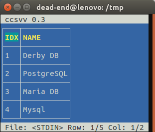

# ccsvv
**ccsvv** (curses csv viewer) is a program that displays 
[CSV](https://en.wikipedia.org/wiki/Comma-separated_values) (comma-separated 
values) files as a table. It supports:

* different field separators
* escaping with **"**
* multi line fields
* different line endings (win / mac / linux)
* unicode characters (wchar_t)
* [header detection](docs/header_detection.md)
* filtering
* sorting

See the [manpage](man/README.md) for the command line options and the commands
that are supported by the running program.


## Installation

### Debian Package
The easiest way to install **ccsvv** is to the use the debian package attached 
to the [latest release](../../releases/latest). Download the *.deb* file, check 
the md5 sum and install the package:

```bash
md5sum ccsvv_X.Y.Z_amd64.deb
sudo dpkg -i ccsvv_X.Y.Z_amd64.deb
```

### Build from Sources
Ensure that the dependencies are fulfilled (see below). Download the sources 
zipfile for the [latest release](../../releases/latest) and compile **ccsvv** 
with:

```
make
```
An alternative is to use cmake. This can be done with:
```
mkdir cmake-build
cd cmake-build
cmake -DCMAKE_BUILD_TYPE=Release ..
make
make test
```

### Binary Tar
Ensure that the dependencies are fulfilled (see below). The 
[latest release](../../releases/latest) contains a tar file with a compiled 
binary. Download the *.tgz* file, check the md5 sum and untar the file. 

```bash
md5sum ccsvv_X.Y.Z.tgz
tar xvzf ccsvv_X.Y.Z_amd64.deb
```

### Dependencies
**ccsvv** uses *ncursesw* to create and display the tables. *ncursesw* is the 
wide character version of *ncurses*.

For the deb package or the precompiled executable the following list of 
dependencies is relevant for ubuntu 18.0.4:

* libc6        (>=2.27)
* libtinfo5    (>=6.1)
* libncursesw5 (>=6.1)

To successfully compile **ccsvv** requires a package with the library and debug 
informations and a developer package with the header files. For ubuntu 18.0.4 
this is:

* libc6            (>=2.27)
* libtinfo5-dbg    (>=6.1)
* libncursesw5-dbg (>=6.1)
* libncursesw5-dev (>=6.1)

If you compiled your own *ncursesw5* lib, make sure that the LD_LIBRARY_PATH is 
properly set.

## Example: /etc/passwd
**ccsvv** can be used to browse through all kinds of csv like files. The 
following example shows the `/etc/passwd` file, filtered by *system*.
```
ccsvv -d : /etc/passwd
```


## Example: Derby DB
In this section we want to discuss how to use **ccsvv** to display the results 
of a database client. 

We use Derby DB as our database, which has a client called `ij`. It accepts a 
property file, with basic configurations. In our case 
[ij.properties](derby-db/ij.properties):

```properties
ij.user=user
ij.password=password
ij.database=mydb
#ij.database=mydb;create=true
ij.protocol=jdbc:derby:
ij.showNoCountForSelect=true
ij.showNoConnectionsAtStart=true
ij.maximumDisplayWidth=256
```
For our example, we need to create an example database with a table. This can be 
done with a sql file [create.sql](derby-db/create.sql) with the following 
content:

```sql
create table mytab(idx int, name varchar(40));
insert into mytab values (1,'Derby DB'); 
insert into mytab values (2,'PostgreSQL'); 
insert into mytab values (3,'Maria DB'); 
insert into mytab values (4,'Mysql'); 
```
We can execute the statements with the following call. This requires the flag 
`create=true` to be set in the [ij.properties](derby-db/ij.properties) file. 
Make sure that you removed the flag after you created the database, to prevent 
warnings.

```bash
ij -p ij.properties create.sql
```

Piping a select statement to the ij client returns the table data. 

```
echo "select * from mytab;" | ij -p ij.properties 
ij version 10.14
ij> select * from mytab;
NUM        |ADDR                                    
----------------------------------------------------
1          |Derby DB                                
2          |PostgreSQL                              
3          |Maria DB                                
4          |Mysql                                   
ij>
```
This result is OK as long as the table is small. 

To be able to use the output of ij for **ccsvv**, we have to remove the 
unnecessary lines. This can be done with a small shell script. The script is 
called with a sql statement and the first step is to copy that statement to a 
file. Using a file rather than piping the statement to the client gives better 
control over the promt of `ij`.

A call of `grep` removes the line, that separates the header from the table 
data, the `ij` prompt, the version information and lines that only consist of a 
single `;`. This happens if you forget the `;` character after your sql 
statement. The last line pipes the resulting data to **ccsvv**. The field 
separator is the pipe character `|`: 

```bash
#!/bin/sh
set -u
echo "$@" > .derby.sql
result=$(ij -p ij.properties .derby.sql | grep -v -e '^-*$' -e '^ij>' -e '^ij version' -e '^;$')
echo "$result" | ./ccsvv -s -d '|' || echo "$result"
```

An example call of the script [derby_client.sh](derby-db/derby_client.sh) with 
the result: 

```
sh derby_client.sh "select * from mytab"
```



## Further readings
There are some implementation details documented at the following pages:

- [Header detection](docs/header_detection.md)

- [Implementation details](docs/implementation_details.md)

I use docker to build and verify installation packages and to ensure that the
installation documentation is correct. A description can be found at:

- [Docker support](docker/README.md)

