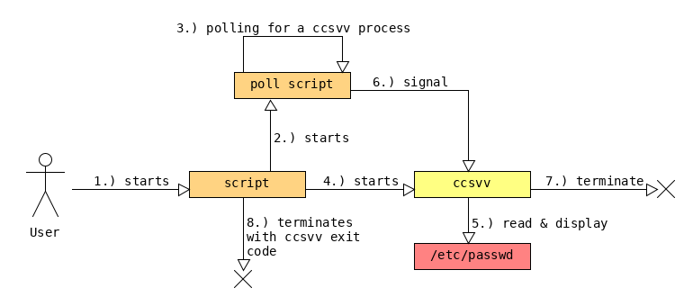

# Docker

I am using docker to test *ccsvv*, the build of *ccsvv* and the installation of *ccsvv* 
on various linux distributions. 
The docker files can be seen as an installation instruction. It shows the installation 
requirements as well as the installation process.

The following script triggers all docker builds and tests, that are described below. It 
can be used with a *clean* argument, that deletes all docker images and containers before
the tests.

[bin/test_docker.sh](bin/test_docker.sh)

## Smoke tests

Testing a terminal based application is not easy. *ccsvv* has several unit tests
that are running during the build, which tests the business logic. Additionally 
*ccsvv* has a test script, that performs a simple smoke test:

[bin/test_run.sh](bin/test_run.sh)

The aim of the script is to start *ccsvv* which reads and displays a file 
(`/etc/paaswd`). The script then sends a signal (`SIGUSR1`) which causes
*ccsvv* to terminate. The script itself terminates with the return code of *ccsvv*.
This can only be accomblished with a background process, that polls for a
*ccsvv* process and sends a signal if such a process comes to existance. This
signal terminates *ccsvv*.



The smoke test ensures that the execution flag is set for the *ccsvv* program,
the required libraries are found and that *ccsvv* is able to read and display 
the `/etc/passwd` file.

## Useful docker commands

Search for a docker image:

```
docker search ubuntu
```

Run a docker image *interactively* with a *tty*:

```
docker run -it ubuntu
```

Build a docker image that will be tagged *image_tag* with a docker file *dockerfile* and a docker
context *ctx*, which is a directory that contains mapped files and directories:

```
docker build -t image_tag -f dockerfile ctx
```

You can overwrite build arguments with: 

```
docker build ... --build-arg var_1=value_1 --build-arg var_2=value_2 ...
```

Mount host directory: *$HOME/data* into the container: */data*, start the container and call `ls /data`
on the container directory.

```
  docker run -v $HOME/data:/data debian ls /data
```

You can cleanup the docker images and containers with:

```
docker rm $(docker ps -a -q) ; docker rmi $(docker images -q)
```

List the docker images and containers:

```
docker images

docker ps
```

## Building *ccsvv* from source files

I am using docker to test the build of *ccsvv* from the source files for the following linux systems:

- [archlinux.dockerfile](archlinux.dockerfile)
- [fedora.dockerfile](fedora.dockerfile)
- [centos.dockerfile](centos.dockerfile)

The docker files are quit similar. They install tools used for the build
of the application, they extract the sources and start the build. The main
build tool are:

- zip
- make
- gcc
- ncurses libraries

During the build, unit tests are started. They require a locale with UTF8 to be set.
The different linux systems have different default locales installed. For
example archlinux has:

```dockerfile
ENV LANG=en_US.utf8
```

The *ccsvv* application uses a config script from ncurses to get configuration
data for the build. Depending on the installed ncurses major version this script is
`ncurses5-config` or `ncurses6-config`:

```dockerfile
ARG NCURSES_MAJOR=6
```

To be able to start *ccsvv* it is important to set the path. This is required 
for the test script `test_run.sh`:

```dockerfile
ENV PATH=$PATH:/tmp/curses_csv_viewer-master
```

You can build the image and run a smoke test with the following commands:

```bash
sudo docker build -t ccsvv_archlinux -f docker/archlinux.dockerfile docker/

docker run -it ccsvv_archlinux sh /tmp/curses_csv_viewer-master/bin/test_run.sh
```

The build on centos fails. The ncurses header file does not contain all wide
character related functions. This is not a *ccsvv* issue, but it shows that
the tests are a good idea.

```bash
 cc -c -o build/ncv_forms.o src/ncv_forms.c -std=c11 -O2 -D_GNU_SOURCE  -Wall -Wextra -Wpedantic -Werror -Iinc  -lncursesw -ltinfo -lformw -lmenuw -lm
src/ncv_forms.c: In function 'forms_driver':
src/ncv_forms.c:46:2: error: implicit declaration of function 'form_driver_w' [-Werror=implicit-function-declaration]
  const int result = form_driver_w(form, key_type, chr);
  ^
cc1: all warnings being treated as errors
make: *** [build/ncv_forms.o] Error 1
```

## Building a *.deb* package

I am using docker to build a *.deb* packages for the *ccsvv* application.
This is done in several steps. The first step is to create a docker image
that builds the application from its source files. This is similar to the
builds for the other linux systems. After the build the package is created.
This is done in the following docker file:

[deb.build.dockerfile](deb.build.dockerfile)

After we created the *.deb* package, we want to know if it works, by
installing the package and running the test script. But the image contains
all the dependencies of *ccsvv*, because they are necessary for the build.

To do a proper testing, we copy the *.deb* file from the image to the host
file system. This is done with the command:

```dockerfile
docker cp $(docker ps -q -l):/<image-dir>/ccsvv.deb <host-dir>
```

And then we create a new image without the dependencies. We
install the *.deb* package on that image start the container and run the
smoke test script.

[deb.install.dockerfile](deb.install.dockerfile)
